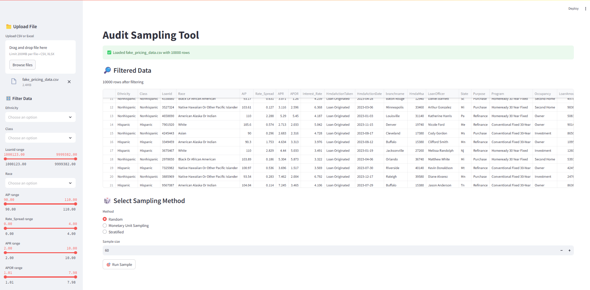

# Colby Kellersberger, MAcc, CIA, CFE, CICA

Internal audit professional bridging compliance and analytics — using SQL, Python, and Power BI to automate controls, surface risk, and drive decision-making.

---

### 💼 Contact & Resume

- [LinkedIn Profile](https://www.linkedin.com/in/colby-k)
- [Email Me](mailto:colby.keller@gmail.com)
- [Resume – Web View](resume.md)
- [Resume – PDF Download](assets/docs/Resume.pdf)
---

## 💻 Tech Stack

|  |  |  |  |
|:--:|:--:|:--:|:--:|
| **Power BI** | **SQL** | **Excel** | **Python** |

---

## Featured Projects

### 📊 Power BI Dashboards

- 🔗 [Adventure Works Report](https://app.powerbi.com/view?r=eyJrIjoiODhkYWI5ZmYtZTk0Yy00NjUwLTg0YjItNjI3ODA3MDk1N2U5IiwidCI6ImRmODY3OWNkLWE4MGUtNDVkOC05OWFjLWM4M2VkN2ZmOTVhMCJ9)  
  

- 🔗 [Property Management Dashboard](https://app.powerbi.com/view?r=eyJrIjoiZjc0MTliNDYtNjZmYy00MWY1LTlmNTEtMmFiNGI2Y2FmOGY2IiwidCI6ImRmODY3OWNkLWE4MGUtNDVkOC05OWFjLWM4M2VkN2ZmOTVhMCJ9)  
  

- 🔗 [Sales Analysis (SQL + Power BI)](https://github.com/colby-k/SQL_PowerBI_Project_Sales_Analysis)  
  

---

### 🐍 Python & SQL Projects

- 📁 [SQL Project – Data Job Analysis](https://github.com/colby-k/SQL_Project_Data_Job_Analysis)  
  Job market insight project using PostgreSQL, VS Code, Python, and Pandas.

- 📁 [Fair Lending Analysis (Python)](https://github.com/colby-k/Python_Project_Fair_Lending_Analysis)  
  Fair pricing audit simulator using synthetic borrower data, statistical analysis, ipywidgets UI.

---

### 🧰 Audit Sampling Tool (Preview)

An internal audit sampling utility built with Python and Streamlit.  
Upload → Filter → Sample → Export.

---

## 🔧 Coming Soon

- 📦 Installer version of GUI app  
- 🛠️ New dashboards & automated testing templates  

---

> *“The most dangerous phrase in the language is: we've always done it this way.”* – Rear Admiral Grace Hopper
