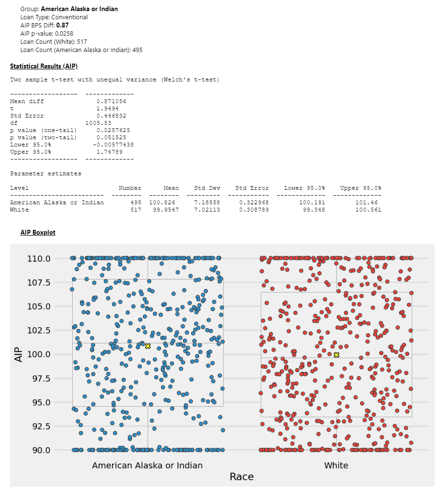
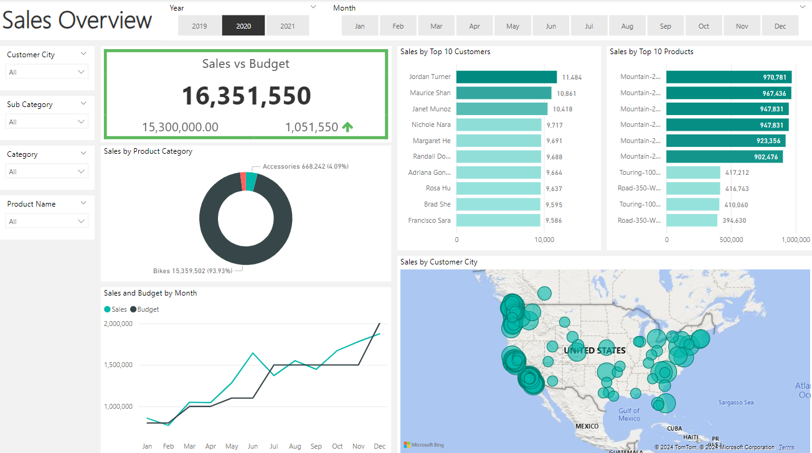
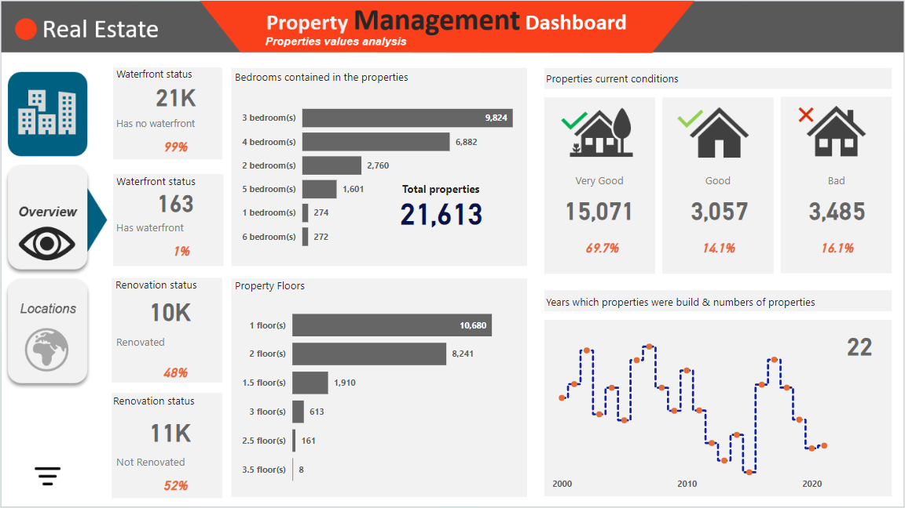

# Data Analysis Portfolio

### Technical Skills: SQL, Python, Power BI, Excel

# Projects
## [Project 1: SQL Project Data Job Analysis](https://github.com/colby-k/SQL_Project_Data_Job_Analysis)

This project was driven by a desire to better understand the data job market. I wanted to understand what the demand for data analysts is, what skills are in demand, and where the demand for data analysts meets the demand for high salaries.

For my deep dive into the data analyst job market, I utilized the power of several tools:

- **SQL:** The main tool I used to analyze the data. SQL allowed me to query the database and identify critical insights.
- **PostgreSQL:** The particular database management system, I used to store and analyze my data.
- **Visual Studio Code (VS Code):** My preferred code editor for database management and executing SQL queries.
- **Python/Jupyter Notebook:** I used to analyze and visualize my data.
- **Git & GitHub:** Essential for version control and sharing my SQL scripts and analysis, ensuring collaboration and project tracking.

## [Project 2: Python Fair Lending Analysis](https://github.com/colby-k/Python_Project_Fair_Lending_Analysis)

This project was one of the responsibilities I had as a Senior Data Analyst Manager for a mortgage company. I was asked to build out a fair lending monitoring program where loan pricing could be analyzed for pricing disparaties between different borrower demographics. The dataset used in this analysis is not real, and I used a Python Package (Faker) to create dummy data so that there was no sensitive data used and no privacy concerns. The results of this analysis does not imply, or one cannot and should not assume that the lending practices of any lender are based on the results of this analysis.

I felt it was important to showcase this analysis in my portfolio, because this is how I learned Python, and realized what is possible when you have a "Growth Mindset".

For my project I utilized the following tools:
- **Python:** I used Python (3.12) to perform the analysis. I used Jupyter Notebooks to create the analysis.
- **Pandas:** I used Pandas to read in the data and perform the analysis.
- **Faker:** I used Faker to create the fake borrower data.
- **Bioinfokit:** I used Bioinfokit to perform the statistical analysis.
- **Matplotlib:** I used Matplotlib to create the visualizations.
- **Seaborn:** I used Seaborn to create the visualizations.
- **Ipywidgets:** I used Ipywidgets to create the interactive UI for the analysis to allow the user to select the different perameters of the analysis including the inclusion of visualations, list of loans, stat charts, etc.
- **VS Code:** I used VS Code to create the Jupyter Notebooks.
- **Git & GitHub:** I used Git and GitHub to track my work.

## [Project 3: SQL & Power BI Project Sales Analysis](https://github.com/colby-k/SQL_PowerBI_Project_Sales_Analysis)

This project set out to explore the AdventureWorks dataset from Microsoft SQL Server. The dataset contains sales data for a fictitious company. The goal was to explore the data and create a PowerBI report to answer questions about the company.

For my project I utilized the following tools:

- **Microsoft SQL Server:** Database management system.
- **SQL:** Language used to query the database and export the data for Power BI.
- **Visual Studio Code:** My preferred code editor for SQL queries.
- **Power BI:** Data visualization tool. -Git & GitHub: Version control system and repository.

## Power BI Dashboards / Reports

These are a few Power BI Dashboards / Reports I have built from trainings and learnings to become more familiar with Power BI. 

