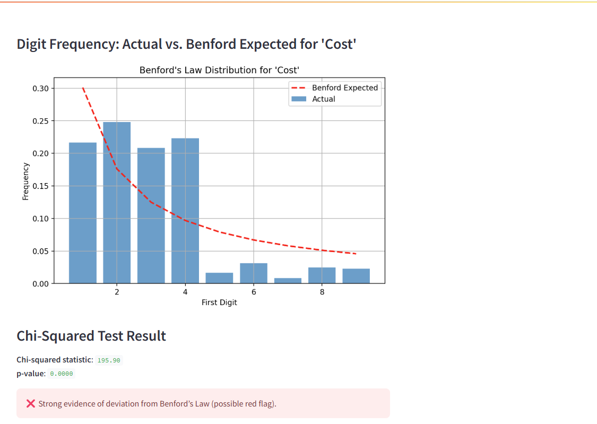

## 🚀 Featured Projects

### 📊 Power BI Dashboards

**[Adventure Works Report](https://app.powerbi.com/view?r=eyJrIjoiODhkYWI5ZmYtZTk0Yy00NjUwLTg0YjItNjI3ODA3MDk1N2U5IiwidCI6ImRmODY3OWNkLWE4MGUtNDVkOC05OWFjLWM4M2VkN2ZmOTVhMCJ9)**  

**[Property Management Dashboard](https://app.powerbi.com/view?r=eyJrIjoiZjc0MTliNDYtNjZmYy00MWY1LTlmNTEtMmFiNGI2Y2FmOGY2IiwidCI6ImRmODY3OWNkLWE4MGUtNDVkOC05OWFjLWM4M2VkN2ZmOTVhMCJ9)**  

**[Sales Analysis – SQL + Power BI](https://github.com/colby-k/SQL_PowerBI_Project_Sales_Analysis)**  

---

### 🐍 Python + SQL Projects

**[Fair Lending Analysis](https://github.com/colby-k/Python_Project_Fair_Lending_Analysis)**  
Fair pricing audit simulator using synthetic borrower data, statistical testing, and ipywidgets UI.

**[Data Job Market Analysis](https://github.com/colby-k/SQL_Project_Data_Job_Analysis)**  
SQL + Python project analyzing job posting data and extracting trends using PostgreSQL and Pandas.

---

### 🧪 Streamlit Tools

**Audit Sampling Tool**  
  
Upload data → filter → sample → export — a lightweight utility for audit teams.

**Benford's Law Audit Tool**  
  
Digit distribution checker using Benford’s Law and chi-squared analysis.  
[GitHub Repo](https://github.com/colby-k/benfords-law-audit-tool)

---
