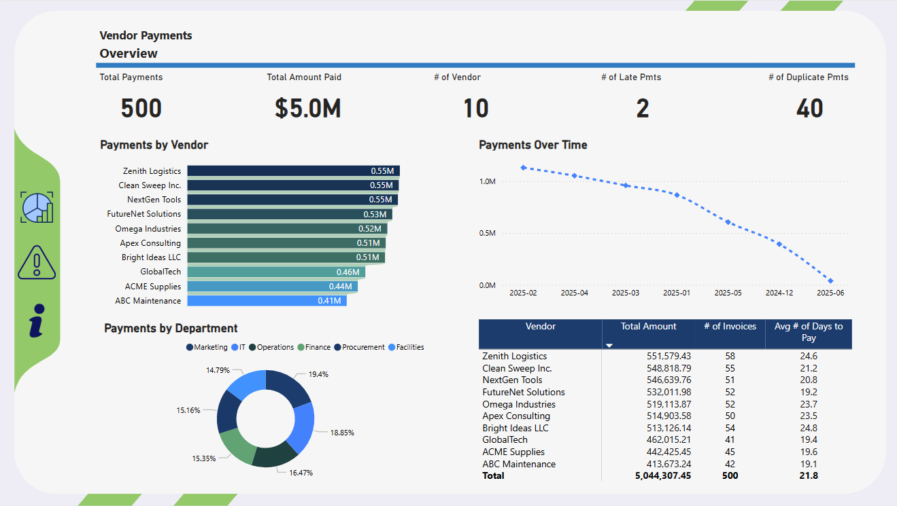
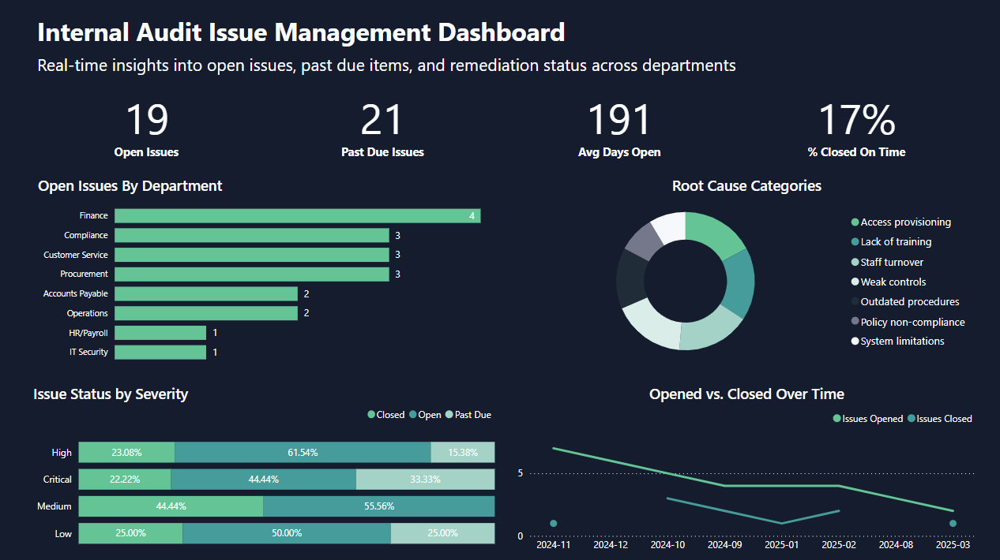



  <a href="/">Home</a> ·
  <a href="/excel-tools/">Excel Tools</a> ·
  <a href="/audit-analytics/">Audit Analytics</a> ·
  <a href="/sql-projects/">SQL Projects</a> ·
  <a href="/about/">About</a>

# Audit Analytics

##  Power BI Dashboards

### Vendor Payments Monitoring  

Risk-focused dashboard for vendor payments and unusual transaction patterns.

---

### Internal Audit Issue Tracker  

Tracks open vs closed issues and management action plans.

---

  <strong>📊 Click to expand: 3 more Power BI dashboards</strong>

 

### Adventure Works Report  

### Property Management Dashboard  

### Sales Dashboard  

---

##   Python Audit Apps (Streamlit)

### Audit Sampling Tool  

> **Objective:** generate statistically sound, reproducible samples for audit testing.

  

Internal audit sampling utility for filtering, random sampling, and file export.

---

### Benford's Law Audit Tool  

> **Objective:** quickly test numeric fields for Benford conformity and flag anomalies that may indicate fraud or error.

  

Statistical fraud detection tool using Benford’s Law to flag anomalies in financial data.  
[GitHub Repo](https://github.com/colby-k/benfords-law-audit-tool)

---

### Fair Lending Analysis  

> **Objective:** simulate pricing and underwriting outcomes and test for potential disparate impact across borrower groups.

   

Fair lending pricing and underwriting simulator using synthetic borrower data, statistical testing, and interactive controls.

