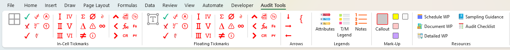



  <a href="/">Home</a> |
  <a href="/excel-tools/">Excel Tools</a> |
  <a href="/audit-analytics/">Audit Analytics</a> |
  <a href="/sql-projects/">SQL Projects</a> |
  <a href="/about/">About</a>

I’m an **Internal Audit Manager (CIA, CFE, CICA)** who builds:

- **Excel audit tools** (tickmark add-in, risk templates)
- **Audit analytics** in **Power BI**
- **Python apps** for sampling, Benford’s tests, and fair lending analysis

> My goal: make audit testing **more efficient, risk-focused, and repeatable.**

Tools I Use:

  

  

  

  

  

  

  

---

##  Excel Audit Tools

### Tickmark Excel Add-In

Custom Excel **`.xlam`** add-in to streamline audit fieldwork and documentation with consistent, professional notation.

Highlights:

- One-click tickmarks (✔, ✘, Δ, ≠, ∅, etc.) in-cell or floating  
- Roman numerals, circled numbers/letters, page indicators  
- Built-in tickmark legend and reference templates  

👉 **Full details:** [Excel Audit Tools](/excel-tools/#excel-add-in-tickmark)

---

### Risk Assessment Matrix (Excel Template)

Configurable Excel-based risk matrix for internal audit and compliance.

Highlights:

- Customizable risk factors and scoring  
- Visual heatmap to highlight high-risk areas  

👉 **More info & download:** [Excel Audit Tools](/excel-tools/#risk-assessment-matrix)

---

## 📊 Audit Analytics

I use **Power BI** and **Python/Streamlit** to support risk-based audits:

- Vendor payments monitoring (duplicate/split payments, unusual vendors)
- Internal audit issue tracking dashboards
- Sampling and Benford’s Law analysis apps
- Fair lending pricing/underwriting simulator

👉 **See dashboards and apps:** [Audit Analytics](/audit-analytics/)

---

## 🔢 SQL & Data Projects

Past projects using **SQL + Power BI** to analyze:

- Data job market skills and pay  
- Sales performance and profitability  

👉 **Project details:** [SQL & Data Projects](/sql-projects/)

---

## 👤 About & Contact

I’m an **Internal Audit Manager (CIA, CFE, CICA)** currently working in a diversified holding company environment,
focused on risk-based auditing and building tools that make testing more effective.

📫 Best way to reach me: [LinkedIn](https://www.linkedin.com/in/colby-k/)
