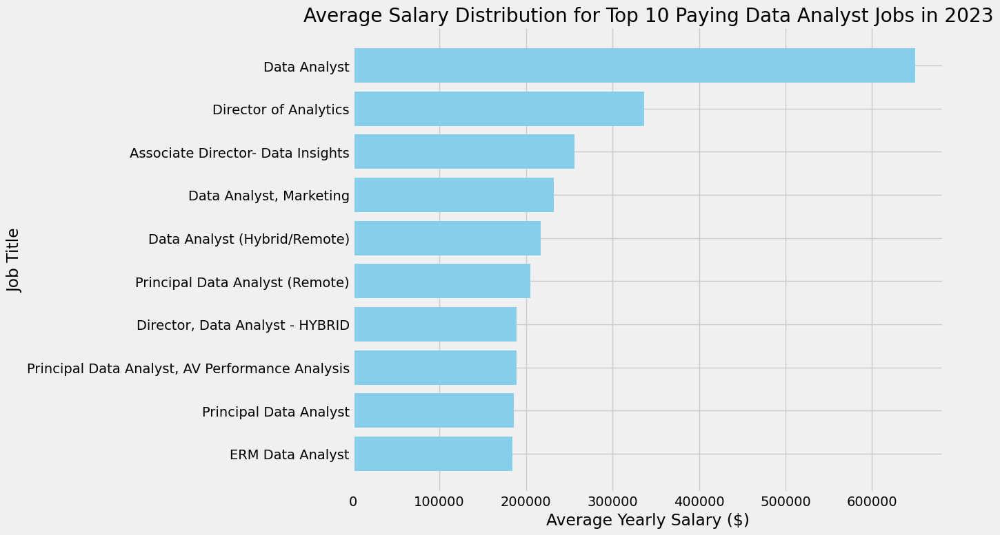

With 15+ years of experience in internal audit, compliance, fraud investigations, and data analytics, I combine subject-matter expertise with tools like **Power BI**, **SQL**, and **Python** to turn data into insight and action.

---

## 🧰 Skills

- Power BI | Python | SQL | Excel
- Internal Audit | Risk Assessment | Issue Tracking
- Fraud Detection | Data Visualization | Compliance Analytics

---

##  Power BI Dashboards

#### Internal Audit Issue Tracker  

#### Adventure Works Report  

#### Property Management Dashboard  

#### Sales Dashboard  

##  Python Projects

#### Fair Lending Analysis
[GitHub Repo](https://github.com/colby-k/Python_Project_Fair_Lending_Analysis)  
Fair pricing audit simulator using synthetic borrower data, statistical testing, and ipywidgets UI.

#### Audit Sampling Tool
  
Internal audit sampling utility for filtering, random sampling, and file export.

#### Benford's Law Audit Tool
  
Statistical fraud detection tool using Benford’s Law to flag anomalies in financial data.  
[GitHub Repo](https://github.com/colby-k/benfords-law-audit-tool)

##  SQL Projects

#### Data Job Market Analysis  
[GitHub Repo](https://github.com/colby-k/SQL_Project_Data_Job_Analysis)  
SQL analysis of job postings using PostgreSQL and Python to surface skill trends.

- [Sales ETL & Dashboard](https://github.com/colby-k/SQL_PowerBI_Project_Sales_Analysis)

##  Excel Templates

#### Risk Assessment Matrix  
Download a customizable Excel-based risk matrix for internal audit and compliance teams.  
📂 [Download Template](assets/files/Risk_Assessment_Template.xlsx)

---

## 🧪 More Coming Soon

- Audit Planning Template  
- Risk & Control Matrix (RCM)  
- Issue Tracking Log  

Stay tuned as I continue expanding this portfolio.
