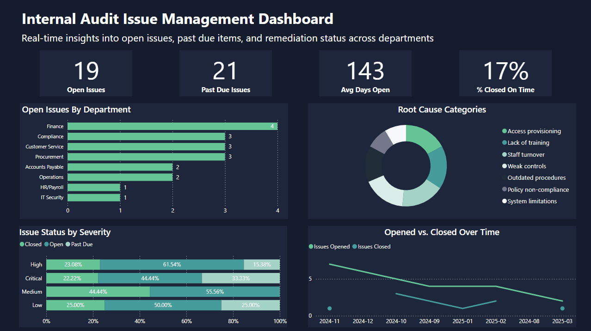
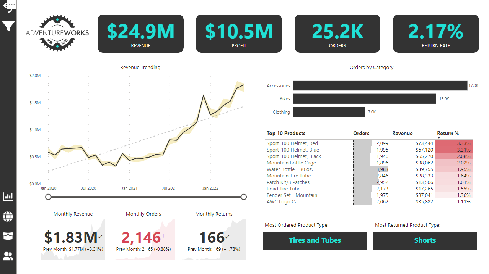
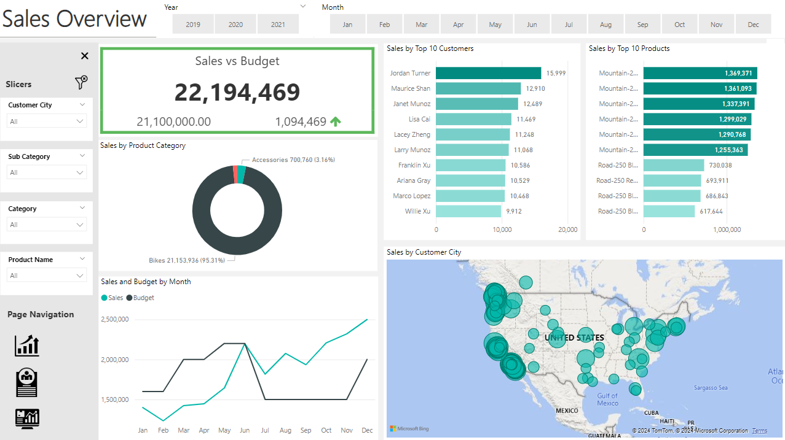
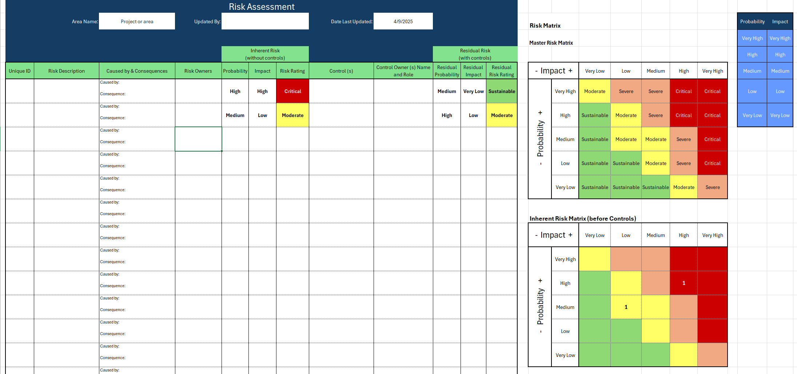

<!-- Your main content remains unchanged below -->

# Hi, I’m **Colby** — an **Internal Audit and Compliance Leader turned Data Analyst** with a passion for turning data into decisions.

I bring **15+ years of experience** in internal audit, risk management, and fraud investigations, with a strong foundation in financial services and regulatory environments.

Today, I apply tools like **Power BI, SQL, and Python** to build dashboards, perform full-population analysis, and uncover meaningful insights. While many of my projects support **audit and compliance** use cases, this portfolio also includes **exploratory work across industries**—ranging from sales to property management—as I continue expanding my data analytics skill set.

Whether it's **improving governance through data** or **building dashboards from scratch**, I enjoy solving real problems and making data accessible to stakeholders.

  <a href="#featured-projects" class="view-work-button">↓ View My Work</a>
  
⬇️

---

### 📇 Contact & Resume
- [LinkedIn Profile](https://www.linkedin.com/in/colby-k)
- [Email Me](mailto:colby.keller@gmail.com)
- [Resume – Web View](resume.md)
- [Resume – PDF Download](assets/docs/Resume.pdf)

---

### 🛠️ Tech Stack

  

    <a href="#power-bi-dashboards" title="See Power BI Projects">
      
      
Power BI

    </a>
  

  

    <a href="#sql-projects" title="See SQL Projects">
      
      
SQL

    </a>
  

  

    <a href="#excel-templates" title="See Excel Templates">
      
      
Excel

    </a>
  

  

    <a href="#python-projects" title="See Python Projects">
      
      
Python

    </a>
  

---

## 📊 Featured Projects 

### 📈 Power BI Dashboards 
- 🔗 [Internal Audit Issue Tracker](https://app.powerbi.com/view?r=eyJrIjoiNjY0YjI4NmYtNWJlNy00YWY4LThjMTctZjZlNDQ0ZmYzNDRkIiwidCI6ImRmODY3OWNkLWE4MGUtNDVkOC05OWFjLWM4M2VkN2ZmOTVhMCJ9)
  
- 🔗 [Adventure Works Report](https://app.powerbi.com/view?r=eyJrIjoiODhkYWI5ZmYtZTk0Yy00NjUwLTg0YjItNjI3ODA3MDk1N2U5IiwidCI6ImRmODY3OWNkLWE4MGUtNDVkOC05OWFjLWM4M2VkN2ZmOTVhMCJ9)
  
- 🔗 [Property Management Dashboard](https://app.powerbi.com/view?r=eyJrIjoiZjc0MTliNDYtNjZmYy00MWY1LTlmNTEtMmFiNGI2Y2FmOGY2IiwidCI6ImRmODY3OWNkLWE4MGUtNDVkOC05OWFjLWM4M2VkN2ZmOTVhMCJ9)
  
- 🔗 [Sales Analysis (SQL + Power BI)](https://github.com/colby-k/SQL_PowerBI_Project_Sales_Analysis)
  

---

### 🐍 Python Projects 
- 📁 [Fair Lending Analysis (Python)](https://github.com/colby-k/Python_Project_Fair_Lending_Analysis) – Fair pricing audit simulator using synthetic borrower data, statistical analysis, and ipywidgets UI.
- 📁 [Audit Sampling Tool (Python + Streamlit)](https://audit-sampling-tool.streamlit.app/) – Internal audit sampling utility for filtering, random sampling, and file export.

---

### 🛢️ SQL Projects 
- 📁 [SQL Project – Data Job Analysis](https://github.com/colby-k/SQL_Project_Data_Job_Analysis)
- 📁 [Sales Analysis (SQL + Power BI)](https://github.com/colby-k/SQL_PowerBI_Project_Sales_Analysis)

---

### 📄 Excel Templates 
#### 🛡️ Risk Assessment Template (Excel)
A customizable Excel-based risk assessment matrix designed for internal audit and compliance teams.
- Risk scoring matrix
- Inherent vs. residual risk evaluations
- Auto-calculations and prioritization
📂 [Download Risk Assessment Template (Excel)](assets/files/Risk_Assessment_Template.xlsx)

---

#### 🛠️ More Templates Coming Soon
- Annual Audit Planning Template
- Issue Tracking Log
- Risk & Control Matrix (RCM) Template
