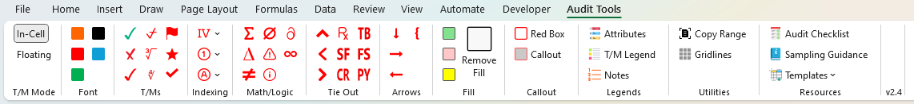
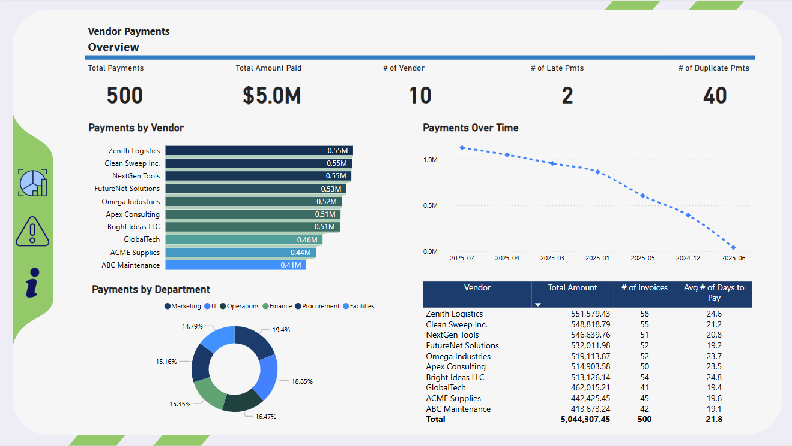
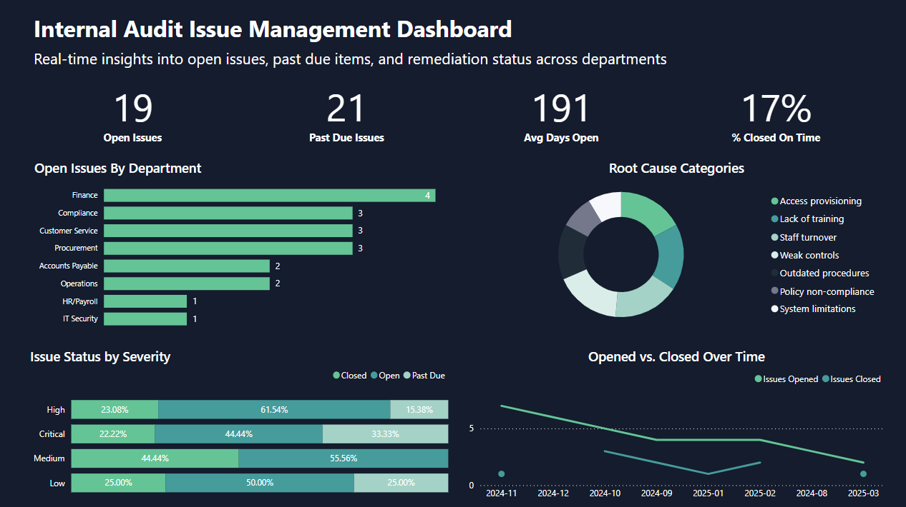



##  Excel Add-In: Tickmark

Custom Excel **`.xlam`** add-in to streamline audit fieldwork and documentation with consistent, professional notation.

> **Status:** Not publicly available yet.  
> **Interested?** I’m gauging demand—please reach out on **[LinkedIn](https://www.linkedin.com/in/colby-k/)**.

[Open User Guide](assets/img/Tickmark%20User%20Guide.png)

### 🔧 Key features
- **One-click tickmarks** (✔, ✘, Δ, ≠, ≈, ∅, ⚠, ⓘ, ∂, ∞) — insert **in-cell** or as **floating** shapes
- **Indexing tools**: Roman numerals, **circled / filled-circled** numbers and letters, **page indicators** (`1/`)
- **Color palette & formatting**: consistent symbol colors and quick layout helpers (grid, alignment)
- **Tie-out abbreviations**: TB, GL, FS, BS, IS, CF, PY, PM, SF, CR, RC with directional variants
- **Annotations**: red box, callout, post-it, arrows, and highlight fills
- **Legends & references**: drop-in legend blocks, links to IIA standards, sampling guidance, and templates

### 🛠 Tech notes
- Built with **VBA**; targets modern Office with **Segoe UI Symbol** coverage.
- Ships as a single `.xlam`; source includes modules for routing, UI callbacks, and symbol libraries.

##  Power BI Dashboards

#### Vendor Payments Monitoring  

#### Internal Audit Issue Tracker  

#### Adventure Works Report  

#### Property Management Dashboard  

#### Sales Dashboard  

##   Python Projects

#### Audit Sampling Tool  
  
Internal audit sampling utility for filtering, random sampling, and file export.

#### Benford's Law Audit Tool  
  
Statistical fraud detection tool using Benford’s Law to flag anomalies in financial data.  
[GitHub Repo](https://github.com/colby-k/benfords-law-audit-tool)

#### Fair Lending Analysis
   
Fair Lending pricing and underwriting simulator using synthetic borrower data, statistical testing, and ipywidgets UI.

##  SQL Projects

#### Data Job Market Analysis  
[GitHub Repo](https://github.com/colby-k/SQL_Project_Data_Job_Analysis)  
SQL analysis of job postings using PostgreSQL and Python to surface skill trends.

#### Sales ETL & Dashboard  
[GitHub Repo](https://github.com/colby-k/SQL_PowerBI_Project_Sales_Analysis)  
SQL-based ETL pipeline to clean and aggregate sales data, paired with a Power BI dashboard for business insights.

##  Excel Templates

#### Risk Assessment Matrix  
Download a customizable Excel-based risk matrix for internal audit and compliance teams.  
📂 [Download Template](assets/files/Risk_Assessment_Template.xlsx)

---

##  More Coming Soon
- FP&A Model
- Audit Planning Template  
- Risk & Control Matrix (RCM)  
- Issue Tracking Log
